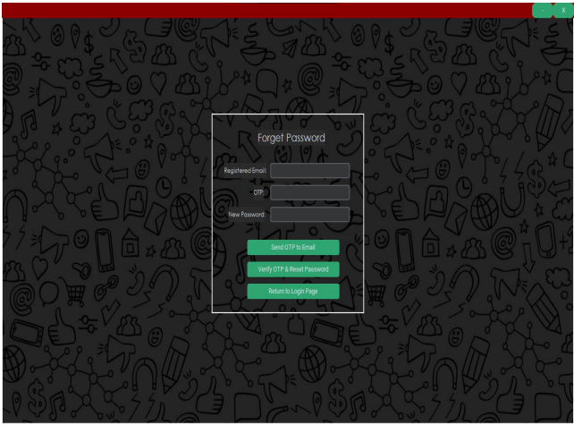

## Project Overview:
The Smart Webcam project is a Python-based application designed to manage and monitor different types of cameras. It integrates various technologies and libraries to offer three main functionalities: webcam, IP webcam, and external camera support. The project uses Tkinter for the graphical user interface, SendGrid API for sending email notifications, CSV files for attendance marking, and dlib for face recognition.

## Screenshots

Features:

Webcam:

Functionality: Allows users to capture video from their local webcam.
Implementation: Utilizes Python’s cv2 (OpenCV) library to access and manage the webcam feed.
IP Webcam:

Functionality: Provides support for connecting to an IP camera. Users can view and manage the feed from remote cameras over the network.
Implementation: Uses OpenCV to connect to the IP camera’s URL, enabling video streaming and processing.
External Camera:

Functionality: Supports external USB cameras connected to the system.
Implementation: Similar to the local webcam functionality but allows selection from multiple connected external cameras.
Technologies Used:

Python: The primary programming language for the project.

Tkinter:

Role: Used for creating the graphical user interface (GUI). Tkinter provides a simple way to build interactive windows and manage user interactions.
Features: Includes buttons, labels, and input fields to manage different camera options and settings.
dlib:

Role: Utilized for face recognition functionalities.
Features: Includes face detection and recognition capabilities. dlib provides accurate face landmark detection and face encoding, which can be used for attendance marking and verification.
SendGrid API:

Role: Used for sending email notifications.
Features: Integrates with SendGrid to send notifications about attendance, system alerts, or any other relevant information. API keys are used for authentication and sending emails.
CSV:

Role: Manages attendance marking.
Features: Records attendance data in CSV files, making it easy to track and export information. The application writes timestamps and user data to CSV files for record-keeping.
Implementation Details:

GUI with Tkinter:

The main window contains options to select between Webcam, IP Webcam, and External Camera.
Buttons and menus are used to start and stop the video feed, configure settings, and send notifications.
Face Recognition with dlib:

Captures frames from the video feed and processes them to detect and recognize faces.
Matches detected faces with stored data for attendance and verification purposes.
Email Notifications with SendGrid API:

When specific events occur (e.g., attendance marked, system alerts), the application sends email notifications using SendGrid.
Email templates and recipients are managed through the API.
Attendance Marking with CSV:

Each time a user is recognized, their attendance is recorded in a CSV file with a timestamp.
The CSV file is updated in real-time, ensuring accurate and up-to-date attendance records.
Usage:

Setup:

Install required libraries: cv2, dlib, sendgrid, and others.
Configure SendGrid API keys for email notifications.
Ensure all necessary drivers and dependencies for camera access are installed.
Running the Application:

Launch the application using Python.
Use the Tkinter interface to choose the type of camera and start the video feed.
Utilize face recognition features and manage attendance records.
Send notifications as needed through the SendGrid integration.
Conclusion:
The Smart Webcam project is a comprehensive solution that integrates camera management with advanced features like face recognition and email notifications. It provides a user-friendly interface and leverages powerful libraries to offer robust functionality for monitoring and attendance management.
